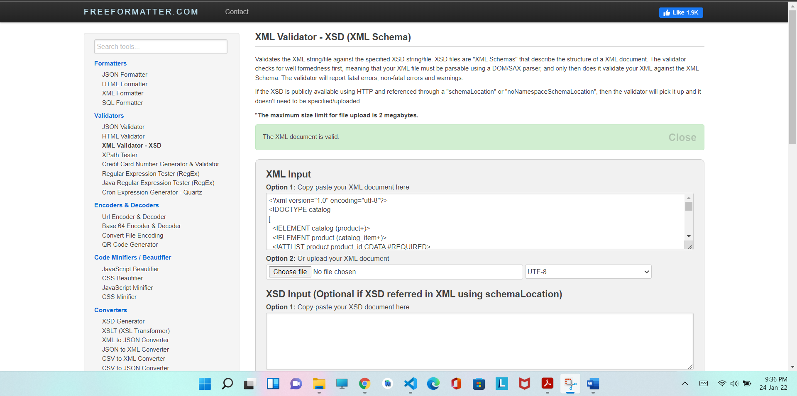
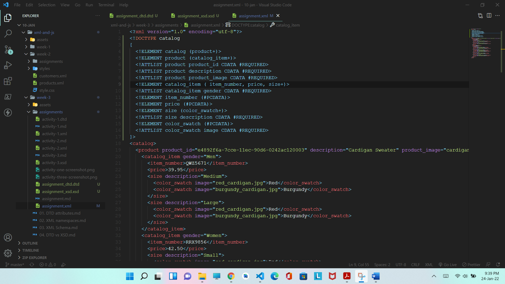
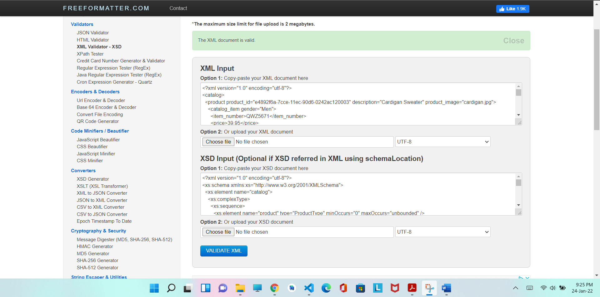
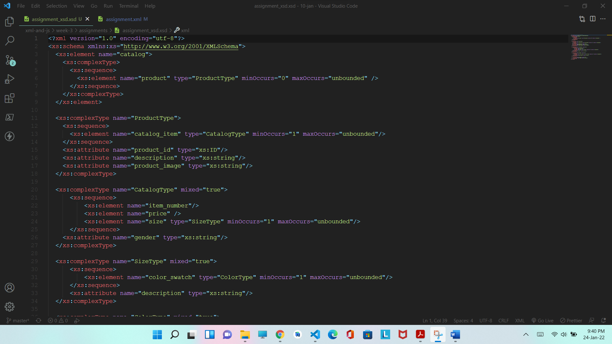

# Assignment 3

1. Create DTD for this file and validate it using any of the tools we used
    
    
2. Create XSD for this file and validate it using any of the tools we used
    
    
3. Explain your thought process for these 2 declarations

- DTD is easy to develop and is less time consuming as compared to XSD. At the same time, XSD is more readable, easy to understand and reusable.
