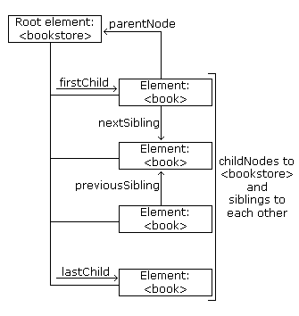

# XML DOM Nodes

According to the XML DOM, everything in an XML document is a node:

- The entire document is a document node
- Every XML element is an element node
- The text in the XML elements are text nodes
- Every attribute is an attribute node
- Comments are comment nodes

```xml
<?xml version="1.0" encoding="UTF-8"?>
<bookstore>
  <book category="cooking">
    <title lang="en">Everyday Italian</title>
    <author>Giada De Laurentiis</author>
    <year>2005</year>
    <price>30.00</price>
  </book>
  <book category="children">
    <title lang="en">Harry Potter</title>
    <author>J K. Rowling</author>
    <year>2005</year>
    <price>29.99</price>
  </book>
  <book category="web">
    <title lang="en">XQuery Kick Start</title>
    <author>James McGovern</author>
    <author>Per Bothner</author>
    <author>Kurt Cagle</author>
    <author>James Linn</author>
    <author>Vaidyanathan Nagarajan</author>
    <year>2003</year>
    <price>49.99</price>
  </book>
  <book category="web" cover="paperback">
    <title lang="en">Learning XML</title>
    <author>Erik T. Ray</author>
    <year>2003</year>
    <price>39.95</price>
  </book>
</bookstore>
```

The root node in the XML above is named `<bookstore>`.

All other nodes in the document are contained within `<bookstore>`.

The root node `<bookstore>` holds 4 `<book>` nodes.

The first `<book>` node holds the child nodes: `<title>`, `<author>`, `<year>`, and `<price>`.

The child nodes contain one text node each, "Everyday Italian", "Giada De Laurentiis", "2005", and "30.00".

> **Text is Always Stored in Text Nodes**. A common error in DOM processing is to expect an element node to contain text. However, the text of an element node is stored in a text node. In this example: `<year>2005</year>`, the element node `<year>` holds a text node with the value "2005". "2005" is not the value of the `<year>` element.

## XML DOM Node Tree

The XML DOM views an XML document as a tree-structure. The tree structure is called a node-tree.

All nodes can be accessed through the tree. Their contents can be modified or deleted, and new elements can be created.

The node tree shows the set of nodes, and the connections between them. The tree starts at the root node and branches out to the text nodes at the lowest level of the tree:


## Node Parents, Children, and Siblings

The nodes in the node tree have a hierarchical relationship to each other.

The terms parent, child, and sibling are used to describe the relationships. Parent nodes have children. Children on the same level are called siblings (brothers or sisters).

- In a node tree, the top node is called the root
- Every node, except the root, has exactly one parent node
- A node can have any number of children
- A leaf is a node with no children
- Siblings are nodes with the same parent
- The following image illustrates a part of the node tree and the relationship between the nodes:



Because the XML data is structured in a tree form, it can be traversed without knowing the exact structure of the tree and without knowing the type of data contained within.

## Accessing Nodes

You can access a node in two ways:

1. By using the getElementsByTagName() method
2. By looping through (traversing) the nodes tree.

### getElementsByTagName()

`getElementsByTagName()` returns all elements with a specified tag name.

Syntax:

```js
node.getElementsByTagName("tagname");
```

The `getElementsByTagName()` method returns a node list. A node list is an array of nodes.

```js
const x = xmlDoc.getElementsByTagName("title");
const y = x[2];
```

The length property defines the length of a node list (the number of nodes).

### Traversing Nodes

```js
const nodes = xmlDoc.documentElement.childNodes;

const text = Array.from(nodes).reduce((acc, node) => {
  // Process only element nodes (type 1)
  if (node.nodeType == 1) {
    acc += node.nodeName + "<br>";
  }

  return acc;
}, "");
```

1. Suppose you have loaded "books.xml" into xmlDoc
2. Get the child nodes of the root element (xmlDoc)
3. For each child node, check the node type. If the node type is "1" it is an element node
4. Output the name of the node if it is an element node

## Node Properties

In the XML DOM, each node is an object.

Objects have methods and properties, that can be accessed and manipulated by JavaScript.

Three important node properties are:

- `nodeName`
- `nodeValue`
- `nodeType`

### nodeName

The `nodeName` property specifies the name of a node.

- `nodeName` is read-only
- `nodeName` of an element node is the same as the tag name
- `nodeName` of an attribute node is the attribute name
- `nodeName` of a text node is always #text
- `nodeName` of the document node is always #document

### nodeValue

The `nodeValue` property specifies the value of a node.

- `nodeValue` for element nodes is undefined
- `nodeValue` for text nodes is the text itself
- `nodeValue` for attribute nodes is the attribute value

### nodeType

The `nodeType` property specifies the type of node.

- `nodeType` is read only.

| Node type | NodeType |
| --------- | -------- |
| Element   | 1        |
| Attribute | 2        |
| Text      | 3        |
| Comment   | 8        |
| Document  | 9        |
